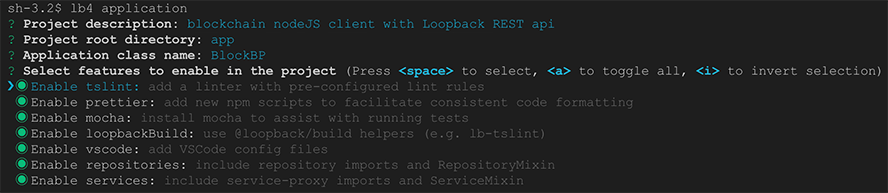
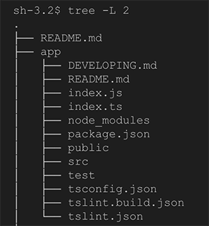
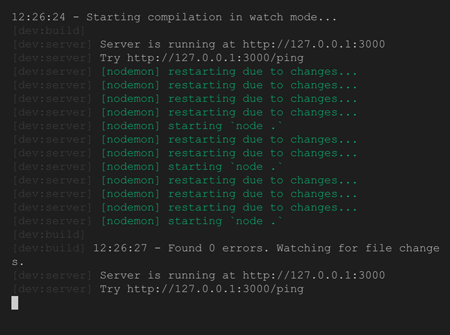
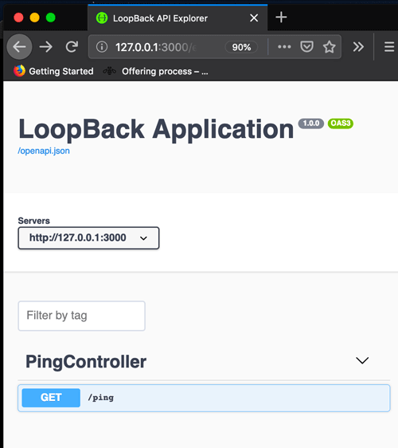

# boilerplate nodeJS application

    So this is the boilerplate for a Loopback  nodeJS application

## Steps
l. Introduction

ll. Install NVM

lll. Create a Loopback NodeJS Application

lV. Install nodeJS productivity tools

V. Adding a new REST endpoint

Vl. Calling Hyperledger Fabric Network


### Step l. Introduction
This a JavaScript/TypeScript application
created with Loopback v4, which provides
a NodeJS boilerplate, and an OpenAPI  REST interface. 

### Step ll. Install nvm
[NVM](https://github.com/creationix/nvm#install-script) the, node version manager is a useful tool that lets you install and choose specific version of node

```sh
curl -o- https://raw.githubusercontent.com/creationix/nvm/v0.34.0/install.sh | bash
```


### Step lll.  Create a Loopback NodeJS Application
Install loopback CLI
```sh
npm i -g @loopback/cli
```

create the application

```sh
lb4 application
```
you will be prompted with certain questions and choices to create the application




This will create the nodeJS application in the app/ directory with all the necessary files.



this will create a ping controller in src/controllers/ping.controlelr.ts


### Step lV. 
To aid development, these node packages will auto watch files on save and autocompile the typescript ( so you will not need to restart npm each time )

```sh
npm i -D nodemon
npm i -D concurrently
```

change the following lines in package.json
```
from 
    "build:watch": "lb-tsc --watch",
to
    "build:watch": "lb-tsc es2017 --outDir dist --watch",

and add
    "dev": "concurrently \"npm:dev:build\" \"npm:dev:server\"",
    "dev:build": "npm run build:watch",
    "dev:server": "nodemon .",
```

now you should be able to run node and not have to restart!

```sh
node run dev
```



Check out the nodeJS REST api, by navigating here
[localhost loopback explorer](http://127.0.0.1:3000/explorer/)





### Step V. Adding a new REST endpoint
We will now add  new endpoints for a simple tic-tac-toe game

the board is represented by a list[0-8]  
[
_, _, _,
_, _, _,
_, _, _
]

the empty boad

as the game proceeds say
with two player GS and LS for example
```sh
setp 1
[
_, _, _,
_, LS|X, _,
_, _, _
]

setp 2
[
_, _, GS|O,
_, LS|X, _,
_, _, _
]

setp 3
[
LS|X, _, GS|O,
_, LS|X, _,
_, _, _
]

setp 4
[
LS|X, _, GS|O,
_, LS|X, _,
_, _, GS|O
]

setp 5
[
LS|X, _, GS|O,
_, LS|X, LS|X,
_, _, GS|O
]

setp 6
[
LS|X, _, GS|O,
GS|O, LS|X, LS|X,
_,  LS|X, _
]

setp 7
[
LS|X, _, GS|O,
GS|O, LS|X, LS|X,
_,  LS|X, GS|O
]

setp 8
[
LS|X, GS|O, GS|O,
GS|O, LS|X, LS|X,
_,  LS|X, GS|O
]

setp 9
[
LS|X, GS|O, GS|O,
GS|O, LS|X, LS|X,
LS|X,  LS|X, GS|O
]
```

/tic-tac-toe

GET starts a new game

returns new game guid and blank board 
```json
{"boadUUID":<<uuid>>,
 "cells":
 [
_, _, _,
_, _, _,
_, _, _
],
"state":"initialized|underway|over",
"winner":"<<user-initials>>"
```


POST will allow 2 players to make thier marks - 
request json game_uuid: blank or uuid, their name and x/o and a position on the grid, the response is the grid
each transcation will be keyed off player initials, position[0-8], and X or O ( capital X or Oh )
response will be the { "game_uuid": <<seeded with intial empty board>>, "board in play":[LS|X, GS|O, GS|O,GS|O, LS|X, LS|X,_,  LS|X, GS|O], "gameState":"winner|GS or no winner or freshgame" }


### Adding a model
To setup the request and response datastructures we need to add a model - a datastructure representing the game board, it's id, cells and state:

Add a new file under src/models/ and call it tictactoe.model.ts
Copy and past the following:

```TypeScript
import {model, property} from '@loopback/repository'

@model({name: 'TicTacToeBoard'})
export class TicTacToeBoard {
  constructor(data?: Partial<TicTacToeBoard>) {
    if (data != null && typeof data === 'object') {
      Object.assign(this, data);
    }
  }

  @property({name: 'boardUUID', required: true})
  boardUUID: string;

  @property({name: 'state', required: true, default: 'intialized'})
  state: string;

  @property({name: 'winner', required: false, default: ''})
  winner: string;
  
  @property({
    type: 'array',
    itemType: 'string',
    required: true,
  })
  cells: string[];

}

```


Great so now we have a model that represents our board!
Lets implement a controller to create a new board, via
a GET endpoint and a PUT to allow players to make their Naughts and Crosses on that board.

### Adding a Controller
Add a new file under src/controllers/ and call it tictactoe.controller.ts
Copy and past the following:

```TypeScript
import { Request, RestBindings, operation, requestBody } from '@loopback/rest';
import { inject } from '@loopback/context';

import { TicTacToeBoard } from '../models/tic-tac-toe-board.model';

const uuidv1 = require('uuid/v1');


export class TictactoeController {
  constructor(@inject(RestBindings.Http.REQUEST) private req: Request) { }


  /**
   *
   * Creates empty tictactoe board
   * @returns TicTacToeBoard
   */
  @operation('get', '/Tictactoe', {
    responses: {
      '200': {
        description: 'Tictactoe model instance',
        content: { 'application/json': { schema: { 'x-ts-type': TicTacToeBoard } } },
      },
    },
  })
  tictactoeCreate(): TicTacToeBoard {

      let cells = ['_','_','_','_','_','_','_','_'];
      return new TicTacToeBoard({boardUUID: this.getUUID(), 
        cells: cells, state:'initialized', winner:""})
  }


    /**
    * Update board by id ( UUID )
    * @param requestBody TicTacToeBoard Model instance data
    * @returns TicTacToeBoard
    */
  @operation('put', '/Tictactoe', {
    responses: {
      '200': {
        description: 'TicTacToeBoard model instance',
        content: { 'application/json': { schema: { 'x-ts-type': TicTacToeBoard } } },
      },
    },
  })
  async tictactoeUpdate(@requestBody() requestBody: TicTacToeBoard): Promise<TicTacToeBoard> {
    console.log(requestBody);
    return requestBody;
  } 

  getUUID():string{
    return uuidv1()
  }

}


```

### Step Vl. Calling Hyperledger Fabric Network
Now we have a basic NodeJS application that has a REST interface we can now
start to get it connected to a basic Hyperledger Fabric peer's Smart Chain Code.

Firstly we assume you have a basic network up and running ( see here for local setup using VSCode Extenstions if need be ... <<< to be added >>>)

export connection from network <<< tba >>>
add network.yaml

```yaml
---
#
# The network connection profile provides client applications the information about the target
# blockchain network that are necessary for the applications to interact with it. These are all
# knowledge that must be acquired from out-of-band sources. This file provides such a source.
#
name: "basic-network"

#
# Any properties with an "x-" prefix will be treated as application-specific, exactly like how naming
# in HTTP headers or swagger properties work. The SDK will simply ignore these fields and leave
# them for the applications to process. This is a mechanism for different components of an application
# to exchange information that are not part of the standard schema described below. In particular,
# the "x-type" property with the "hlfv1" value example below is used by Hyperledger Composer to
# determine the type of Fabric networks (v0.6 vs. v1.0) it needs to work with.
#
x-type: "hlfv1"

#
# Describe what the target network is/does.
#
description: "The basic network"

#
# Schema version of the content. Used by the SDK to apply the corresponding parsing rules.
#
version: "1.0"

#
# [Optional]. But most apps would have this section so that channel objects can be constructed
# based on the content below. If an app is creating channels, then it likely will not need this
# section.
#
channels:
  # name of the channel
  mychannel:
    # Required. list of orderers designated by the application to use for transactions on this
    # channel. This list can be a result of access control ("org1" can only access "ordererA"), or
    # operational decisions to share loads from applications among the orderers.  The values must
    # be "names" of orgs defined under "organizations/peers"
    orderers:
      - orderer.example.com

    # Required. list of peers from participating orgs
    peers:
      peer0.org1.example.com:
        # [Optional]. will this peer be sent transaction proposals for endorsement? The peer must
        # have the chaincode installed. The app can also use this property to decide which peers
        # to send the chaincode install request. Default: true
        endorsingPeer: true

        # [Optional]. will this peer be sent query proposals? The peer must have the chaincode
        # installed. The app can also use this property to decide which peers to send the
        # chaincode install request. Default: true
        chaincodeQuery: true

        # [Optional]. will this peer be sent query proposals that do not require chaincodes, like
        # queryBlock(), queryTransaction(), etc. Default: true
        ledgerQuery: true

        # [Optional]. will this peer be the target of the SDK's listener registration? All peers can
        # produce events but the app typically only needs to connect to one to listen to events.
        # Default: true
        eventSource: true

#
# list of participating organizations in this network
#
organizations:
  Org1:
    mspid: Org1MSP

    peers:
      - peer0.org1.example.com

    # [Optional]. Certificate Authorities issue certificates for identification purposes in a Fabric based
    # network. Typically certificates provisioning is done in a separate process outside of the
    # runtime network. Fabric-CA is a special certificate authority that provides a REST APIs for
    # dynamic certificate management (enroll, revoke, re-enroll). The following section is only for
    # Fabric-CA servers.
    certificateAuthorities:
      - ca-org1

#
# List of orderers to send transaction and channel create/update requests to. For the time
# being only one orderer is needed. If more than one is defined, which one get used by the
# SDK is implementation specific. Consult each SDK's documentation for its handling of orderers.
#
orderers:
  orderer.example.com:
    url: grpc://localhost:17050

    # these are standard properties defined by the gRPC library
    # they will be passed in as-is to gRPC client constructor
    grpcOptions:
      ssl-target-name-override: orderer.example.com

#
# List of peers to send various requests to, including endorsement, query
# and event listener registration.
#
peers:
  peer0.org1.example.com:
    # this URL is used to send endorsement and query requests
    url: grpc://localhost:17051

    grpcOptions:
      ssl-target-name-override: peer0.org1.example.com
      request-timeout: 120001

# Fabric-CA is a special kind of Certificate Authority provided by Hyperledger Fabric which allows
# certificate management to be done via REST APIs. Application may choose to use a standard
# Certificate Authority instead of Fabric-CA, in which case this section would not be specified.
#
certificateAuthorities:
  ca-org1:
    url: http://localhost:17054
    # the properties specified under this object are passed to the 'http' client verbatim when
    # making the request to the Fabric-CA server
    httpOptions:
      verify: false

    # Fabric-CA supports dynamic user enrollment via REST APIs. A "root" user, a.k.a registrar, is
    # needed to enroll and invoke new users.
    registrar:
      - enrollId: admin
        enrollSecret: adminpw
    # [Optional] The optional name of the CA.
    caName: ca-org1
```


add the blockchainClient.ts

```TypeScript


```


## pre-requisites
ensure you have VSCode installed first

```sh
mkdir block-boilerplate
cd block-boilerplate
echo "opening vs code in this directory"
code .
```
